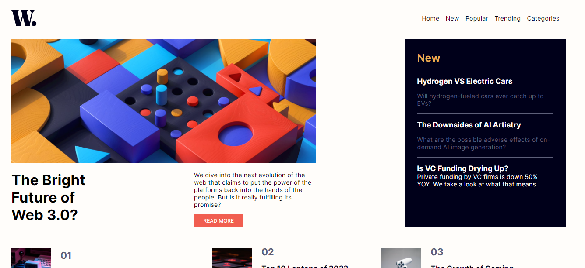
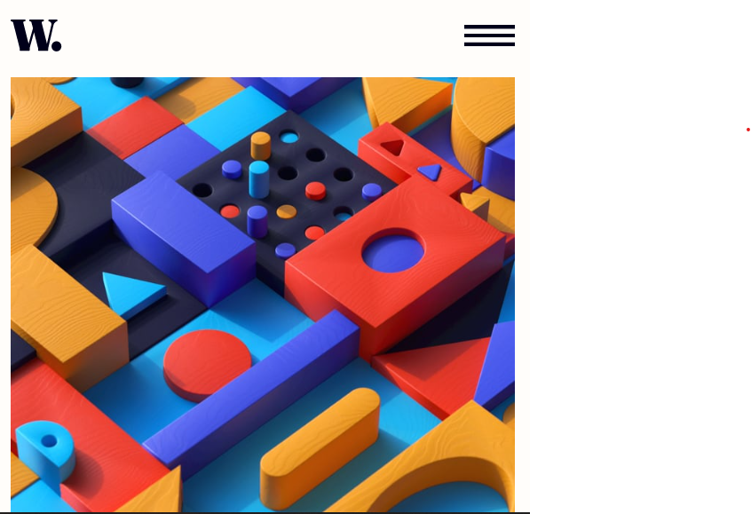

# Frontend Mentor - News homepage solution

This is a solution to the [News homepage challenge on Frontend Mentor](https://www.frontendmentor.io/challenges/news-homepage-H6SWTa1MFl). Frontend Mentor challenges help you improve your coding skills by building realistic projects. 

## Table of contents

- [Overview](#overview)
  - [The challenge](#the-challenge)
  - [Screenshot](#screenshot)
  - [Links](#links)
  - [My process](#my-process)
  - [Built with](#built-with)
  - [What I learned](#what-i-learned)
  - [Continued development](#continued-development)

## Overview
The challenge is to build a new homepage website as a Blog like site

### The challenge

Users should be able to:

- View the optimal layout for the interface depending on their device's screen size
- See hover and focus states for all interactive elements on the page
- **Bonus**: Toggle the mobile menu (requires some JavaScript)

### Screenshot

### Links

- Solution URL: [Solution](https://github.com/Davidmide02/News-homepage-main.git)
- Live Site URL: [live site](https://genuine-muffin-197fb4.netlify.app/)

## My process
- Thorough analysis of the design
- Setting the required files
- Palcing of HTML blocks
- Styling
- Functionality of the Menu

### Built with

- Semantic HTML5 markup
- CSS custom properties
- Flexbox
- CSS Grid
- Mobile-first workflow

### What I learned

The pertinent knowledge i gained during this project is don not just jump to design, analysis properly putting into consideration the Responsiveness and other important factors.

### Continued development

- Add Dark mode
- Use a motion Hambuger instead of image

## Author

- Website - [Add your name here](https://www.github.com/Davidmide02)
- Frontend Mentor - [@yourusername](https://www.frontendmentor.io/profile/Davidmide02)
- Twitter - [@yourusername](https://www.twitter.com/Davidmide02)

